# cloudflare-worker-stats

[](https://deploy.workers.cloudflare.com/?url=https://github.com/sd416/cloudflare-worker-stats)

A Cloudflare Worker that generates a dynamic SVG bar chart showing the last 7-30 days of traffic from the Cloudflare Analytics API. Designed for embedding in a GitHub profile README.

Supports two modes:
- **Zone mode** - tracks HTTP requests for a specific domain using `CF_ZONE_ID`
- **Worker mode** - tracks Worker invocations across your account using `CF_ACCOUNT_ID` (ideal for Workers on `*.workers.dev` or unbound from a specific zone)

## Theme Options

Choose a theme by appending the theme name to your worker URL. The default theme is **Neon Terminal**.

| Theme | Path | Description |
|-------|------|-------------|
| **Neon Terminal** | `/` or `/neon` | Dark terminal aesthetic with vertical bar chart, dot grid, glow effects, and Cloudflare Orange |
| **Minimal** | `/minimal` | Clean card with full-width sparkline area chart and emerald accents |
| **Gradient** | `/gradient` | Vibrant gradient background with horizontal daily breakdown bars (cyan-to-purple) |
| **Dashboard** | `/dashboard` | Stat tile grid (avg/day, peak, bandwidth, visitors) with sparkline and indigo accents |
| **Badge** | `/badge` | Compact shields.io-style pill (~28px tall) with label and total, ideal inline in a README |
| **Heatmap** | `/heatmap` | GitHub contribution-graph style grid of daily cells, best with `?days=30` |
| **Ticker** | `/ticker` | Stock-market candlestick style with green/red daily bars, change %, and HI/LO/VOL |

### Neon Terminal (`/neon`, default)

Vertical bar chart with a terminal/hacker aesthetic. Monospace fonts, dot grid background, glow effects.



### Minimal (`/minimal`)

Full-width sparkline area chart with a clean, lightweight card design. Green accent line with shaded area fill.


### Gradient (`/gradient`)

Horizontal daily breakdown bars with day-of-week labels and per-day request counts. Gradient background with cyan-to-purple bar fills.


### Dashboard (`/dashboard`)

Stat tile grid showing average requests/day, peak day, bandwidth, and unique visitors alongside the total and a sparkline.


### Badge (`/badge`)

Compact shields.io-style pill showing the label and total, perfect inline next to other badges.


### Heatmap (`/heatmap`)

GitHub contribution-graph style grid where each cell is a day, colored by traffic intensity. Pairs well with `?days=30`.


### Ticker (`/ticker`)

Stock-market candlestick aesthetic with green/red daily bars vs. the previous day, change %, and HI/LO/VOL stats.


All themes automatically adapt to **light/dark mode** via the `prefers-color-scheme` media query.

## Options

Append query parameters to any theme URL:

| Parameter | Description |
|-----------|-------------|
| `?days=N` | Number of days to chart (1-30, default 7). Charts and labels adapt automatically. |
| `?refresh` | Bypass the 1-hour cache. |

```markdown

```

## Features

- Fetches the last 7-30 days of request data from the Cloudflare GraphQL Analytics API (`?days=N`)
- Displays total requests in compact format (e.g. `2.14M`)
- Shows **avg/day** and **peak day** stats on every theme
- Shows **bandwidth** (data served) and **unique visitors** (zone mode) when available
- Renders a 480×160 SVG chart
- **Seven distinct UI themes**: Neon Terminal, Minimal, Gradient, Dashboard, Badge, Heatmap, and Ticker
- Automatically adapts to light/dark theme via `prefers-color-scheme` media query
- One-click deploy via the button above

## Quick Start

### 1. Deploy

Click the **Deploy to Cloudflare Workers** button above, or deploy manually:

```bash
npm install
npm run deploy
```

### 2. Configure Secrets

After deploying, set the required secrets. See [Generating Secrets](#generating-secrets) below for how to obtain these values.

```bash
npx wrangler secret put CF_API_TOKEN
# Then set ONE of the following:
npx wrangler secret put CF_ZONE_ID      # for zone-level HTTP traffic
npx wrangler secret put CF_ACCOUNT_ID   # for account-level Worker events
```

> If both `CF_ZONE_ID` and `CF_ACCOUNT_ID` are set, zone mode takes precedence.

### 3. Embed

Add the worker URL to your GitHub profile README (or anywhere that renders Markdown).

**Default theme (Neon Terminal):**

```markdown

```

**Choose a specific theme:**

```markdown
<!-- Neon Terminal (default) -->


<!-- Minimal Clean -->


<!-- Gradient Modern -->


<!-- Dashboard -->


<!-- Badge (compact pill) -->


<!-- Heatmap (best with 30 days) -->


<!-- Ticker -->

```

**HTML embed (for more control):**

```html

```

**Bypass cache with `?refresh`:**

```markdown

```

**Chart a different time range with `?days`:**

```markdown

```

## Generating Secrets

### `CF_API_TOKEN` - Cloudflare API Token

This token allows the worker to read analytics data.

1. Log in to the [Cloudflare dashboard](https://dash.cloudflare.com/).
2. Click your **profile icon** (top-right) → **My Profile**.
3. Select the **API Tokens** tab.
4. Click **Create Token**.
5. Under **Custom token**, click **Get started**.
6. Configure the token:
   - **Token name**: e.g. `cf-usage-graph-read`
   - **Permissions**:
     - For zone mode: select **Zone → Analytics → Read**
     - For worker mode: select **Account → Workers Scripts → Read** and **Account → Analytics → Read**
   - **Zone Resources** (zone mode only): choose **Include → Specific zone** and pick the zone you want to track (or select **All zones** if you prefer)
   - **Account Resources** (worker mode only): choose **Include → your account**
7. Click **Continue to summary** → **Create Token**.
8. Copy the token value. You will not be able to see it again.

### `CF_ZONE_ID` - Cloudflare Zone ID (zone mode)

The Zone ID identifies which domain's traffic data to query.

1. Log in to the [Cloudflare dashboard](https://dash.cloudflare.com/).
2. Select the domain (zone) you want to track.
3. On the **Overview** page, scroll down to the right-hand sidebar.
4. Under **API**, copy the **Zone ID** value.

### `CF_ACCOUNT_ID` - Cloudflare Account ID (worker mode)

The Account ID identifies your Cloudflare account for querying Worker invocation data. Use this when your Worker runs on a `*.workers.dev` subdomain or is not bound to a specific zone.

1. Log in to the [Cloudflare dashboard](https://dash.cloudflare.com/).
2. On the left sidebar, select **Workers & Pages**.
3. Your **Account ID** is displayed in the right-hand sidebar.

### Storing the Secrets

After you have the required values, store them as Wrangler secrets so they are encrypted and available to the deployed worker:

```bash
npx wrangler secret put CF_API_TOKEN
# Paste your API token when prompted

# For zone mode:
npx wrangler secret put CF_ZONE_ID
# Paste your Zone ID when prompted

# For worker mode:
npx wrangler secret put CF_ACCOUNT_ID
# Paste your Account ID when prompted
```

> **Note:** Never commit these values to source control. Wrangler secrets are encrypted at rest and injected into the worker environment at runtime.

## Development

```bash
npm install          # Install dependencies
npm run dev          # Start local dev server
npm test             # Run tests
npm run screenshots  # Regenerate theme screenshots from sample data
npm run deploy       # Deploy to Cloudflare Workers
```

## Contributing

Contributions are welcome! Feel free to open an issue or submit a pull request.

## License

This project is open-source. See the repository for license details.
